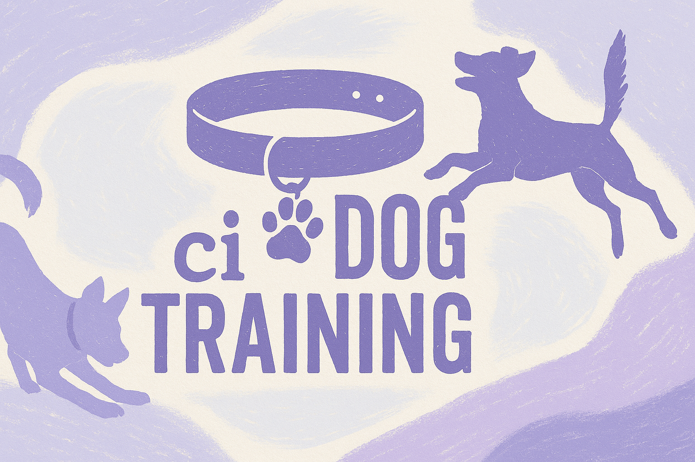

title: ci Dog Training & Walking | Longmont, CO
---

<link rel="stylesheet" href="style.css" />

<a href="#who-am-i" class="arrow-container">
<i class="arrow down"></i>
</a>

## Who am I?

### My name is Robin Fisher (they/she)
### A Longmont resident of nearly 10 years.
### An intermediate dog trainer:
* Working on my [CPDT-KA Certification](https://www.ccpdt.org/about-us/)
* Offering basic to intermediate level training for dogs of all ages.
    * #### Basic commands: 
        * Sit
        * Stay
        * Recall
        * Release
        * Placement
        * Leave / dismiss
    * #### Multiple stage commands 
    * #### Leash skills
        * Curtailing reactivity
        * Loose leash walking
        * Running
    * #### House training
    * #### Crate training
    * #### Muzzle training

    <strong>
        ⚠️ At this time, I can not offer any services to people-aggressive dogs. Although, I am happy to speak with you to determine if your dog falls outside of my skills and experience. ⚠️
    </strong>

## My Services

    <strong>
        ⚠️ Additional $10 per teir if your dog requires any training or reactivity management for any activity below. ⚠️
    </strong>

### Walking

<strong>

20 minutes: $25

40 minutes: $45

60 minutes: $60

</strong>

### Running

    <strong>
$50 per 30 minutes
    </strong>

Got an energetic breed that needs lots of energy released? I offer running services with limited availability

    <strong>
    🚲 Want to bike with your dog? This is an excellent stepping stone! 🚲
    </strong>

### Play Dates / Solo Training

<strong>

Play sessions: $25 per 30 minutes

Solo Training: $35 per 30 minutes

</strong>

Out of the house often? Worried about your dog being alone for too long or just want them to have an extra bit of excitement during their day? Want your pup to study up on their training while you're out and about? I can stop by to train or play with your dogs instead of taking them for a walk.

### In Home Training

    <strong>
$75 per hour
    </strong>

Working with you and your dog directly on your most pressing issues by teaching you how your dog communicates with you through their body language and actions. Strengthen your bond with your dog and effectiveness as a trainer!

### Don't see the service you want listed above? Contact me and we'll see if I can help you. 

## Contact me

### Email: [robin@cidogtraining.com](mailto:robin@cidogtraining.com) 
### Call / Text: [720-378-8019](tel:720-378-8019)